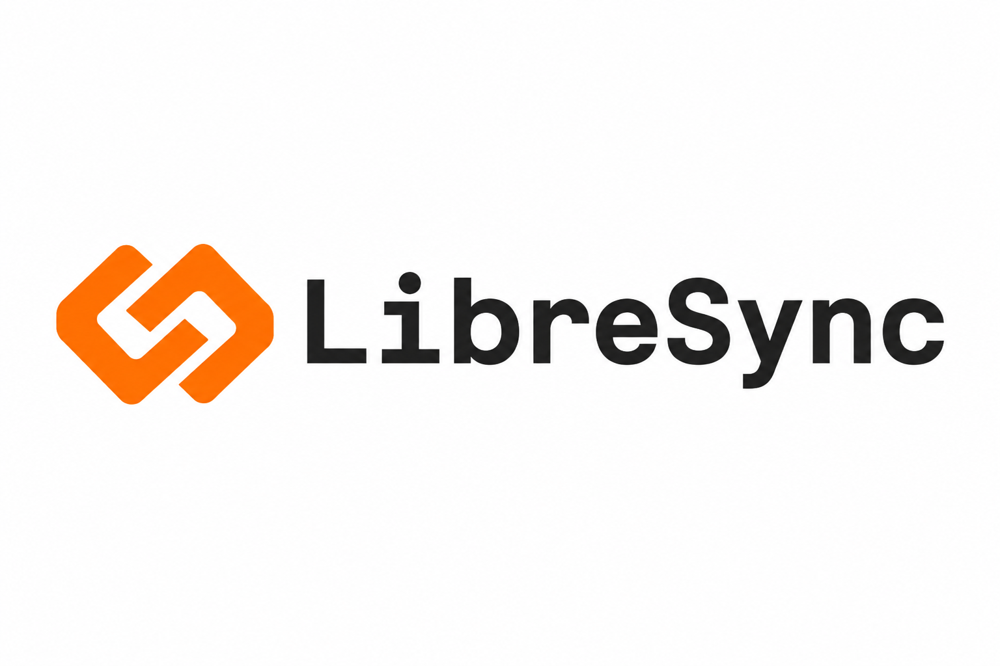

# LibreSync

<p align="center">
  
</p>

- Library enabling device to device data synchronization without connecting to the cloud.

## What is this?
- LibreSync is an open-source AGPLv3 Rust framework that enables real-time and eventual-consistency synchronization of structured application data directly between devices on the same local network (and optional private overlay) without touching the internet.
- End-to-end encryption (E2EE) is enforced by the engine so any app can claim secure, private sync by default.

## Vision
LibreSync should be the gold standard for device-to-device, local-first data synchronization.

Success means:
- Developers can add reliable sync without running always-on devices or maintaining backend infrastructure.
- Users can link once and stay in sync automatically, with clear trust and status indicators.
- Privacy and security are defaults, not optional add-ons.

## Experience goals
DX (developer experience) means how easy it is to integrate, test, and ship with LibreSync.
UX (user experience) means how clear and trustworthy sync feels to the person using the app.

Developer experience:
- Small, stable API surface with strong defaults.
- Clear integration guides, sample apps, and diagnostics.
- Predictable conflict resolution and testable behavior.

User experience:
- No accounts, no cloud dependencies, no surprises.
- Explicit linking and device trust, with easy revocation.
- Always-on sync where possible, fast catch-up when returning online.
- E2EE by default, with clear trust indicators.

## Who is this for?
- Developers who want to add data synchronization to their desktop or mobile app, but don't want to run centralized infrastructure.
- Privacy-conscious users looking for low-level structured data synchronization.
- Researchers: this library can be used to keep several machine's data in sync.

## Why does this exist?
- The cloud _sucks_, leave it behind and unleash local, direct information sharing.
- We are tired of account or service-based sync, I want easy, free, and local sync.
- All devices should be able to share data if consent is given.

## Where can I use this?
- In Rust. This repo is _only_ for the shared sync engine logic.
- Platform-specific libraries are available but still early.
- Desktop (Linux, macOS, Windows) is the supported target today; mobile SDKs remain early.

---

## Library (libresync)
- Register an adapter, start a listener, and enable auto refresh.
- Logical record adapters are the intended primary integration path; file adapters remain available for arbitrary data.
- Adapters can be logical (records) or file-based (JSON, SQLite, arbitrary files).
- `InMemoryLogicalAdapter` provides a minimal record adapter for merge-policy testing.
- `FileLogicalAdapter` persists logical records to a JSON file for simple app storage.
- `SqliteLogicalAdapter` (feature `sqlite-logical`) supports dedicated record tables and mapped existing SQLite tables, including multi-table mappings.
- SQLite file adapters can enable page-delta encoding to reduce payload size when changes are small.
- Auto refresh polls for local changes and syncs with linked devices discovered on the LAN and private overlays.
- Use `AutoRefreshConfig` to customize polling and refresh intervals.
- Use `WatchedFileAdapter` for near-real-time local file change detection.
- Attach an `EventStream` to update UI immediately after sync completes.
- See `crates/libresync/examples/logical_record_sync.rs` for a minimal logical-record example.

```rust
use std::sync::Arc;
use libresync::{Engine, EngineConfig, Identity, JsonFileAdapter, State};

let identity = Identity::new("device-a", "com.example.app", "user-a");
let state = State::new(identity.device_id.clone());
let handler = Arc::new(MyHandler::new());
let mut engine = Engine::new(EngineConfig::new(identity), state, handler);

engine.register_adapter(Arc::new(JsonFileAdapter::new("file", "./data.json")))?;
engine.start_listening()?;
let _auto = engine.auto_refresh("file", "./state.json")?;
```

## CLI (libresync)
The CLI is a device-to-device testing tool that uses LAN/private-overlay discovery, device linking, and JSON/SQLite adapter refresh.

### Install
- Homebrew (macOS/Linux): `brew install dan-hart/tap/libresync`
- From a local checkout: `cargo install --path crates/libresync-cli --force`
- From a release tag: `cargo install --git https://github.com/dan-hart/LibreSync --tag v0.6.1 libresync-cli`

### Quick start
1. Initialize a config on each device:
   - `libresync init`
2. Select a file adapter to keep in sync:
   - `libresync select --file ./data.json`
   - `libresync select --id db --kind sqlite --file ./app.db`
3. Start the device listener (advertises via mDNS, default port 52345):
   - `libresync listen`
4. Link once between devices (consent required):
   - `libresync link`
5. Refresh the selected adapter:
   - `libresync refresh`
6. For continuous updates, run:
   - `libresync watch`
7. Check status (linked + discovered devices):
   - `libresync status`

### Notes
- Linking is required before refresh.
- `link`/`refresh` will discover devices automatically; if multiple are found, you’ll be prompted to pick one.
- `link` prints the local and remote fingerprints so you can verify trust out of band.
- Use `unlink --device-id <device-id>` to revoke trust and force re-linking.
- `watch` refreshes all linked devices on local changes and on a periodic interval (auto-starts a listener by default).
- You can also target a specific device: `--device <ip:port>` or `--device-id <device-id>`.
- Discovery is unauthenticated and only used to find devices; trust is established at linking.
- Discovery includes LAN mDNS plus Tailscale/Headscale peers (when `tailscale` is available).
- For other private overlays, set `LIBRESYNC_OVERLAY_PEERS` to comma-separated `ip[:port]` values.
- `status` shows the selected file, listener status, connected devices (discovered now), last seen addresses, and last seen timestamps for linked devices.
- Config defaults to the OS config directory (override with `--config`).
- `listen` runs in the background by default; use `--foreground` to keep it in the terminal.
- `listen` updates the selected adapter files when incoming refreshes are received.
- `stop` terminates the background listener for the current config.
- Use `--verbose` to include debug details when errors occur.

## LibreSyncAlwaysOn
- Always-on desktop app (LAN-only) written in Rust + Tauri.
- Runs as a device that keeps data synced even when the primary app is closed.
- Status dashboard with manual refresh and per-app backup toggles.
- Snapshot preview and restore controls (restore gated by allow-restore).
- System tray controls and trust panel (linking + fingerprints).
- Intended targets: macOS, Windows, Linux.

## Current limitations
- Logical record sync is the recommended integration path but still early for production apps.
- The SQLite logical adapter supports mapped existing tables, but complex relational schemas still need careful field-policy tuning.
- Discovery on iOS/macOS requires local network permissions and may be blocked by AP isolation.
- SDK wrappers include Keychain/Keystore helpers but still need default integration and UX polish.
- LibreSyncAlwaysOn uses a Linux systemd user service for background behavior; macOS/Windows rely on the tray app.

## Values
- Privacy: a human right
- Security: end-to-end encryption
- Freedom: use this library for free, forever

## License
AGPLv3 - Why? Because it's what we decided upon.

## Security & Privacy Checks
- Install git-secrets and hooks:
  - `brew install git-secrets`
  - `git secrets --install`
  - `git secrets --register-aws`
- Or run the one-shot setup: `./scripts/automation/setup-repo-security.sh .`
- Install the ASP pre-commit hook: `./scripts/automation/install-asp-hooks.sh .`
- Run a full audit before pushing: `./scripts/utilities/security-audit.sh`
- See `SECURITY.md`, `PRIVACY.md`, and `CONTRIBUTING.md` for full guidance.

## Additional documents
- [Quickstart](docs/QUICKSTART.md)
- [Why LibreSync](docs/WHY.md)
- [Research](RESEARCH.md)
- [Security](SECURITY.md)
- [Privacy](PRIVACY.md)
- [Contributing](CONTRIBUTING.md)
- [LibreSyncAlwaysOn](alwaysOn/README.md)
- [Logical record sync](docs/LOGICAL.md)
- [API stability and GUI integration](docs/API.md)
- [Wire protocol](docs/PROTOCOL.md)
- [Packaging on Linux (Flatpak, firewalls, systemd)](docs/PACKAGING-LINUX.md)
- [Packaging on macOS (Swift package, entitlements, Keychain, launchd)](docs/PACKAGING-MACOS.md)
- [Changelog](CHANGELOG.md)
- [SDK surface](docs/SDK.md)
- [Bindings](bindings/README.md)
- [Debugging](docs/DEBUGGING.md)
- [Releasing](docs/RELEASING.md)
- [Releases](RELEASES.md)
- [License](LICENSE)
