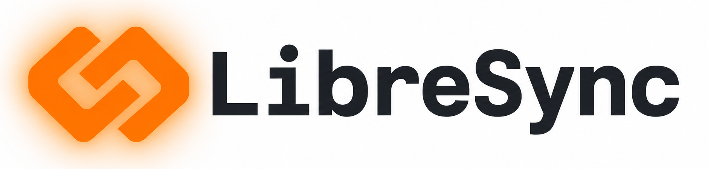

# LibreSync

<p align="center">
  <picture>
    <source media="(prefers-color-scheme: dark)" srcset="docs/assets/libresync-logo-dark.png">
    <source media="(prefers-color-scheme: light)" srcset="docs/assets/libresync-logo.png">
    
  </picture>
</p>

<p align="center">
  <strong>Your data. Your devices. Your sync.</strong><br>
  Encrypted, local-first synchronization for applications that do not need a cloud backend.
</p>

<p align="center">
  <a href="https://github.com/dan-hart/LibreSync/releases/latest"></a>
  <a href="https://github.com/dan-hart/LibreSync/actions/workflows/ci.yml"></a>
  <a href="LICENSE"></a>
</p>
<p align="center">
  <a href="crates/libresync"></a>
  <a href="SECURITY.md"></a>
  <a href="docs/ARCHITECTURE.md"></a>
  <a href="PRIVACY.md"></a>
</p>

<p align="center">
  <a href="#quick-start">Quick start</a> ·
  <a href="#build-with-libresync">Rust integration</a> ·
  <a href="#documentation">Documentation</a> ·
  <a href="CHANGELOG.md">Changelog</a>
</p>

LibreSync is an open-source Rust sync engine for sharing application data between trusted devices on a LAN or an optional private overlay. It combines device discovery, explicit linking, encrypted data exchange, and deterministic conflict resolution without a LibreSync account or hosted sync service.

Use it for notes, tasks, preferences, local databases, and other structured app data. The repository includes the Rust library, a CLI, a C ABI with Swift/Kotlin wrappers, and an optional AlwaysOn desktop companion and daemon.

**Current release: [v0.7.0](https://github.com/dan-hart/LibreSync/releases/tag/v0.7.0).** LibreSync is pre-1.0. Managed Rust, Swift and Android SDKs are available; apps must integrate their model and durable save boundary. CI exercises Linux and macOS; Windows is a desktop target but is not currently in the CI matrix.

## Why LibreSync?

- **Keep control of your data.** Sync between your own devices without operating a backend or requiring cloud accounts.
- **Work locally, catch up later.** Each device retains its data; peers exchange updates when they can connect again.
- **Encrypt by default.** The engine enforces XChaCha20-Poly1305 payload encryption over TLS and encrypts its persisted state and backups.
- **Trust devices explicitly.** Linking establishes per-app trust and exchanges app keys. Certificate fingerprints are pinned after linking; changed fingerprints require attention and re-linking.
- **Merge at the right level.** Logical records support per-field clocks and configurable merge policies, so concurrent changes to different fields can survive synchronization.
- **Send what changed.** Protocol v2 exchanges deltas over one connection, with a full snapshot on first contact or after a state reset.
- **Keep the UI responsive.** A background engine, event queues, wakers, and cancellation support desktop app integration.

## How it works

1. **Discover** peers with the same app ID through LAN mDNS, configured addresses, or private-overlay discovery.
2. **Link** with consent, verify fingerprints, and establish the shared app key. Discovery alone grants no trust.
3. **Sync** through registered adapters. The engine encrypts outgoing data, merges incoming updates, and writes them to local storage.
4. **Stay current** with file watching or periodic refresh. An optional AlwaysOn peer can remain available while your main app is closed.

LAN sync does not require internet access. Optional overlays such as Tailscale or Headscale can connect devices across networks; their connectivity and relay behavior depend on the overlay configuration.

## Quick start

### Install

With Homebrew on macOS or Linux:

```sh
brew install dan-hart/tap/libresync
```

With a Rust toolchain, install the published Git tag:

```sh
cargo install --git https://github.com/dan-hart/LibreSync --tag v0.7.0 libresync-cli
```

Or install from a checkout:

```sh
git clone https://github.com/dan-hart/LibreSync.git
cd LibreSync
cargo install --path crates/libresync-cli --locked
```

The crates are not yet published to crates.io. Use Homebrew, a Git tag, or a local checkout.

### Connect an application

Start with the [managed Session guide](docs/MANAGED-SESSION.md), [Swift notes sample](bindings/swift/Samples/QuickstartApp), or [Android notes sample](bindings/kotlin/sample). A Session owns discovery, its listener, secure pairing and automatic retry. Supply a stable app/schema contract, a private state directory and platform secure storage. Run the working Rust example:

```sh
cargo run -p libresync --example managed_two_peers
```

In an integrated app, choose Connect on the first device and scan its expiring QR invitation or enter its code on the second. Nearby devices have friendly names and compatibility hints; authenticated pairing rechecks identity and schema. An empty app imports automatically. A populated app previews Combine or Cancel and preserves an encrypted pre-merge recovery model. Changes retry automatically after reconnect or app resume.

Status distinguishes Pending, Stored on a peer, and Applied after the destination app durably saves the captured records and receipts. An offline device is waiting. Pause, repair or remove a peer without deleting local data; removal cannot erase its existing remote copies.

The existing CLI and low-level Engine retain their manual linking and file-sync flow. See the [legacy CLI quickstart](docs/QUICKSTART.md#legacy-cli-flow) for that compatible path.

### More CLI options

| Task | Command |
| --- | --- |
| Select logical records | `libresync select --id records --kind logical-file --file ./records.json` |
| Select a SQLite file | `libresync select --id db --kind sqlite --file ./app.db` |
| Enable SQLite page deltas | `libresync select --id db --kind sqlite --page-delta 4096 --file ./app.db` |
| Refresh all registered adapters | `libresync refresh --all-adapters` |
| Refresh every linked device | `libresync refresh --all` |
| Link at a known address | `libresync link --device 192.0.2.10:52345` |
| Remove a trusted device | `libresync unlink --device-id <device-id>` |
| Enable encrypted backups | `libresync backup configure --enable` |
| Create a snapshot | `libresync backup snapshot --note "before import"` |
| Diagnose connectivity | `libresync diagnose` |
| Inspect available commands | `libresync --help` |

Use matching adapter IDs and logical namespaces on peers. A logical-file adapter stores LibreSync records; it is not an arbitrary JSON document. For the address example, replace the documentation address with your peer's reachable IP.

Configuration defaults to the OS config directory; commands accept `--config` for another path. Use `--verbose` for error details. Discovery also checks Tailscale/Headscale peers when the `tailscale` CLI is available; `LIBRESYNC_OVERLAY_PEERS` accepts comma-separated `ip[:port]` addresses. See the [CLI reference](docs/CLI.md) and [two-device testing guide](TESTING.md).

## Build with LibreSync

Add the core library from a release tag:

```toml
[dependencies]
libresync = { git = "https://github.com/dan-hart/LibreSync", tag = "v0.7.0" }
```

Enable `features = ["sqlite-logical"]` on that dependency to use SQLite record mapping. The optional `tailscale-local-api` feature supports discovery through Tailscale's local API socket where the CLI is unavailable.

### Choose an adapter

| Adapter | Best for |
| --- | --- |
| `FileLogicalAdapter` | Structured records persisted in a JSON file |
| `SqliteLogicalAdapter` | Record tables or mappings over existing SQLite tables, including multiple tables; requires `sqlite-logical` |
| `InMemoryLogicalAdapter` | Merge-policy experiments and tests |
| `JsonFileAdapter` | Whole-file JSON synchronization using last-writer-wins |
| `SqliteFileAdapter` | SQLite snapshots with WAL/SHM sidecars and optional page deltas |
| `WatchedFileAdapter` | File adapters with local change notifications |

Logical adapters are the recommended path for structured app data. Policies include last-writer-wins, set union, counters, list append, append-only logs, and app-defined custom merges. Keep record IDs stable and advance the record clock for every local edit. See [logical record sync](docs/LOGICAL.md) for schema and merge semantics.

### Integrate a managed session

Use `Session::open` with a matching transactional adapter and secure `KeyStore`, then `start`. Publish local changes, observe typed snapshots/events and call `wake` on foreground resume. Rust operations perform IO: dispatch them off the UI thread. Native Swift async and Kotlin suspend/Flow APIs provide that dispatch.

Session-owned records are separate from your app database. Obtain a coherent application inbox, commit records **and exact proof-bearing receipts** together to durable app storage, then acknowledge that captured inbox. See [managed sessions](docs/MANAGED-SESSION.md) and [native SDK installation](docs/SDK.md). Existing `Engine` integrations remain available in the [API compatibility guide](docs/API.md).

### Swift, Kotlin, and C

- **Swift:** install the root Git Swift package at `v0.7.0`, or extract the complete release ZIP. Five Apple architecture slices cover macOS, iOS and Simulator. Typed async APIs, Keychain, system Bonjour and optional SwiftUI Connect/Devices/Status components are included.
- **Android:** extract the Maven repository release ZIP and use `io.libresync:libresync:0.7.0`, optionally `libresync-compose`. Both ARM64 and x86_64 JNI libraries support 16 KiB pages. The SDK includes Flow, Keystore and API37 local-network permission guidance.
- **C:** managed ABI v1 has typed JSON and opaque lifetime-safe session handles; legacy Engine ABI v2 remains. See the [C header](bindings/include/libresync.h) and [managed ABI guide](docs/MANAGED-C-ABI.md).

Native policies include exact notes/Momentum contracts and configurable transactional `logical-records-v1`. Unsupported arbitrary custom native policies fail explicitly. Apps with other domain rules implement a pure Rust `ManagedAdapter`; LibreSync cannot synchronize unrelated applications without app integration.

## AlwaysOn companion

[AlwaysOn](docs/COMPANION.md) enrolls supported application spaces independently, with separate keys, trust, records and backup policy. It stores and forwards data while apps are unavailable; its Stored receipt never claims the app has applied data. The dashboard exposes expiring QR/code enrollment, merge consent, device repair/removal, pause and encrypted recovery.

Momentum integration is a separately verified **opt-in** patch pinned to source `766064b`; it does not change the existing Momentum app automatically. See [Momentum migration](docs/MOMENTUM-MANAGED-MIGRATION.md). The optional headless daemon and [service templates](contrib/README.md) need no cloud service.

## Security and current limits

- Payloads, engine state files, and snapshots are encrypted. Application files managed by adapters are not automatically encrypted at rest; apps remain responsible for their local data and key storage.
- The `KeyStore` interface includes file, Linux Secret Service, and macOS Keychain backends. Apps must choose and integrate the appropriate backend.
- Managed pairing uses certificate-bound SPAKE2 and expiring single-use credentials. The SPAKE2 dependency is not independently audited; see SECURITY.md. Legacy Engine linking remains trust on first use.
- Removing a device revokes its allowlist entry. Guided re-keying remains unfinished; use the documented key-rotation workflow when shared keys must change.
- Devices must be reachable at the same time to exchange updates. LAN firewalls, Wi-Fi client isolation, and platform local-network permissions can prevent discovery or sync.
- Logical records and complex relational schemas still require application-specific merge design and testing. File adapters do not provide record-level merging.
- iOS may suspend apps; call wake/resume when active and do not promise continuous background sync. Physical iOS Local Network privacy and camera behavior are unverified. Simulator cannot prove that permission. Android foreground/multicast and background limits still apply.
- Current managed transport defaults to IPv4. No physical-device, two-minute human usability, Finder/Dock reopen, notarized or Developer ID signed GUI acceptance is claimed.

Read the [security policy](SECURITY.md), [privacy policy](PRIVACY.md), and [wire protocol](docs/PROTOCOL.md). Report vulnerabilities through [GitHub private vulnerability reporting](https://github.com/dan-hart/LibreSync/security/advisories/new).

## Development

From the repository root:

```sh
cargo build --workspace
cargo test --workspace
cargo test -p libresync --all-features
cargo clippy --workspace --all-targets --all-features -- -D warnings
```

CI gates parallel Rust tests and strict Clippy, optimized large transfers, five Apple slices/Swift tests/iOS compilation, Android JNI/AAR/Compose/sample and actual API37 x86_64 16 KiB emulator tests. The Linux release checks also run repository and dependency audits, release-version checks, an AlwaysOn smoke build, and a **75% region-coverage minimum**. The CI badge reports workflow status; the coverage threshold is a configured gate, not a live coverage measurement.

Before contributing, follow [CONTRIBUTING.md](CONTRIBUTING.md) for the required git-secrets and ASP hooks, and read the [code of conduct](CODE_OF_CONDUCT.md). See [TESTING.md](TESTING.md) for manual and automated validation and the [release guide](docs/RELEASING.md) for release checks.

## Documentation

| Start here | Go deeper |
| --- | --- |
| [Quickstart](docs/QUICKSTART.md) | [Architecture](docs/ARCHITECTURE.md) |
| [CLI reference](docs/CLI.md) | [Wire protocol](docs/PROTOCOL.md) |
| [Logical record sync](docs/LOGICAL.md) | [API stability and GUI integration](docs/API.md) |
| [Bindings](bindings/README.md) | [SDK surface](docs/SDK.md) |
| [AlwaysOn](alwaysOn/README.md) | [Service and packaging templates](contrib/README.md) |
| [Debugging](docs/DEBUGGING.md) | [Linux packaging](docs/PACKAGING-LINUX.md) / [macOS packaging](docs/PACKAGING-MACOS.md) |
| [Why LibreSync](docs/WHY.md) | [Research](RESEARCH.md) |
| [Changelog](CHANGELOG.md) | [Release history](RELEASES.md) |

## License

LibreSync is licensed under [GNU AGPL v3 only](LICENSE) (`AGPL-3.0-only`).
